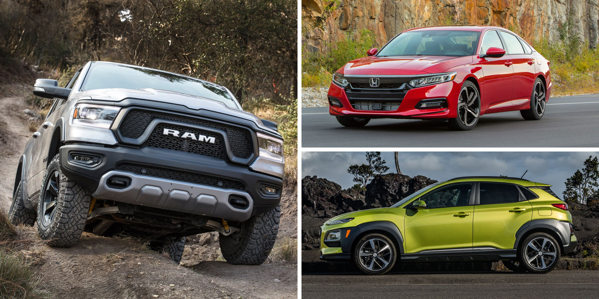
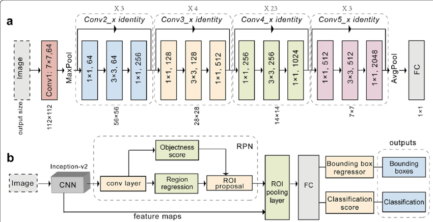

# Vehicle Prediction challenge - ResNet CNN & CART + XGBoost

## Introduction

This project combines a Deep Learning model that attemps to identify the class, Year and make of a car etc. It also includes the most more accurate CART + XGBoost Model that  predicts the vehicle car price after a user uploads a picture of one !

## Datasets

* ResNet Training : Dataset Source [Stanford Car Dataset](https://www.kaggle.com/datasets/jessicali9530/stanford-cars-dataset).

* CART  + XGBoost : Dataset Source [Car Prices Dataset](https://www.kaggle.com/datasets/sidharth178/car-prices-dataset)

## Architecture

### ResNet
This model uses the ResNet PTM for Deep Learning which has an architecture as below 

### CART
The price prediction model uses Various CART models with the most accurate picked for final Price prediction of the car

## Accuracy & Loss evaluation 

## Installation

* Clone this Repo
* Download my saved latest .h5d5 model [here](https://drive.google.com/file/d/11ZnJvCD9vJvupQx2pVUKtob1Plkl9h9N/view?usp=sharing)
* Create a New folder , "models" in the cloned repo and place in it the downloaded file
* Install requirements.txt file with the command `pip install -r requirements.txt`
* Run `pipenv shell`
* Run `streamlit run app.py`
* The Model's website should open in a new Browser window 

